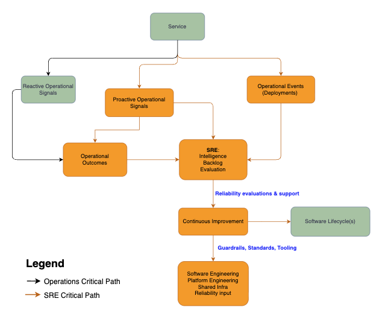
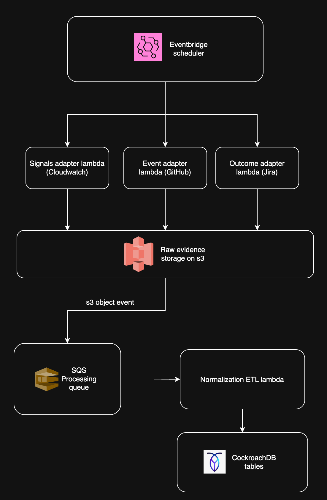
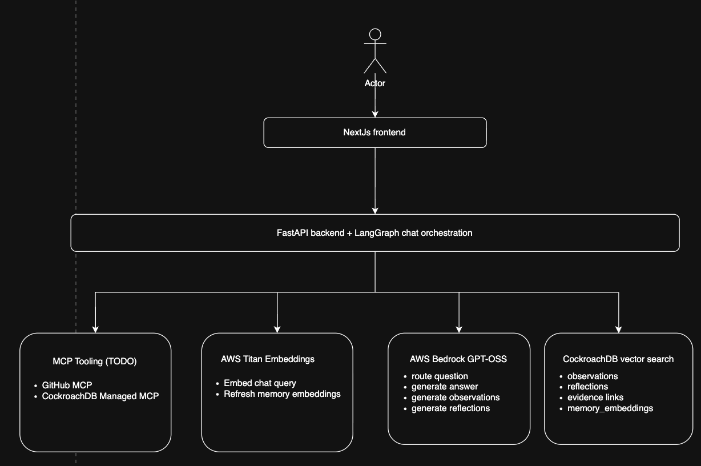

# Memoe

[](https://github.com/mrmuli/memoe/actions/workflows/ci.yml)
[](LICENSE)


Memoe is an operational memory system for SRE intelligence.

It turns operational signals, events, telemetry, and customer outcomes into durable observations and reflections stored in CockroachDB. The demo focuses on reliability memory across services such as `payments`, `orders`, `inventory`, `notifications`, and `search`.



## What Memoe Demonstrates

- Normalized operational evidence stored in CockroachDB.
- Agent-generated observations backed by source evidence.
- Reflection over observations to surface risks, gaps, and recurring patterns.
- CockroachDB vector search over memory embeddings.
- Bedrock model calls for observation, reflection, and chat reasoning.
- Titan embeddings for retrieval over stored memory.
- A simple UI for conversation, observation runs, reflection runs, and memory review.

## Local Demo

Start the full stack:

```bash
docker compose up -d --build
```

Docker Compose starts:

- CockroachDB
- FastAPI backend
- Next.js frontend
- database initialization
- demo fixture seeding

Open the UI:

```text
http://127.0.0.1:3000
```

Backend API:

```text
http://127.0.0.1:8000
```

CockroachDB console:

```text
http://127.0.0.1:8080
```

Watch backend logs:

```bash
docker compose logs -f backend
```

The backend logs high-level observation and embedding activity, including evidence source counts sent to Bedrock and Titan embedding calls. It does not log raw secrets.

Stop the stack:

```bash
docker compose down
```

## Configuration

Copy the example environment file:

```bash
cp .env.example .env
```

For Bedrock, configure your local AWS profile and set:

```text
AWS_REGION=
AWS_PROFILE=
BEDROCK_MODEL_ID=
BEDROCK_EMBEDDING_MODEL_ID=amazon.titan-embed-text-v2:0
EMBEDDING_PROVIDER=bedrock
```

Bedrock-backed observation, reflection, chat, and embedding calls require valid AWS credentials for the configured profile where applicable. The Docker backend mounts your local `~/.aws` directory so Bedrock can use AWS CLI or SSO profile credentials. Do not put AWS access keys or API keys in source control.

## Demo Flow

1. Start the stack with `docker compose up -d --build`.
2. Open `http://127.0.0.1:3000`.
3. Go to the memory page and confirm seeded observations/reflections are visible if already generated.
4. Run an observation for a service, such as `orders`.
5. Watch backend logs to see evidence loaded from GitHub, Jira, and CloudWatch-shaped fixtures.
6. Run a reflection.
7. Open the memory page and confirm titled reflections, such as `orders service: deployment_impact` or `cross-service (5 services): recurring_pattern`.
8. Ask Memoe chat questions that require evidence lookup.

Useful demo questions:

```text
What reliability concerns stand out for the orders service?
```

```text
Was there a ticket opened regarding customer impact on the orders service? What is the ticket number and user report?
```

```text
Which services show customer reports that are not clearly covered by SLOs?
```

```text
Reflect across all services. Which reliability risks should SREs investigate next?
```

More recording guidance is in [docs/demo-script.md](docs/demo-script.md).

## Architecture



```text
Steampipe-shaped fixtures
  GitHub pull requests and deployments
  Jira issues
  CloudWatch alarms and log events
        |
        v
FastAPI ingestion and normalization
        |
        v
CockroachDB
  events
  observations
  reflections
  observation_evidence
  reflection_observations
  memory_embeddings
        |
        v
Bedrock reasoning
  observations
  reflections
  chat answers
        |
        v
Titan embeddings + CockroachDB vector search
  memory retrieval for chat and reflection
```

Memoe stores source-shaped evidence and normalized events in CockroachDB. Observations and reflections are also stored in CockroachDB and linked back to supporting evidence. Embeddings are stored in `memory_embeddings`, allowing chat and reflection to retrieve relevant memory through CockroachDB vector search.

The local demo starts from fixtures, but the intended production ingestion path is event-driven:

```text
EventBridge Scheduler
  -> source adapter Lambdas
  -> S3 raw evidence storage
  -> S3 object event
  -> SQS processing queue
  -> normalization ETL Lambda
  -> CockroachDB normalized Memoe tables
```

In this model, S3 is the raw evidence archive and CockroachDB owns the final Memoe memory shape: normalized events, observations, reflections, evidence links, working memory, and embeddings.

During conversation, Memoe uses LangGraph to route the request, retrieve CockroachDB memory, call Bedrock for reasoning, and use Titan embeddings for memory search.



Runtime responsibilities:

- Next.js provides the user-facing conversation and memory review UI.
- FastAPI and LangGraph orchestrate routing, memory retrieval, optional reflection, and answer generation.
- CockroachDB vector search retrieves observations, reflections, evidence links, and `memory_embeddings`.
- Amazon Titan embeds chat queries and refreshes memory embeddings.
- Amazon Bedrock GPT-OSS routes questions, generates answers, generates observations, and generates reflections.
- MCP tooling is planned for source validation and memory inspection, including GitHub MCP and CockroachDB Managed MCP.

## Hackathon Criteria Mapping

AWS service used:

- Amazon Bedrock Converse API for observation, reflection, chat routing, and chat answering.
- Amazon Titan Text Embeddings through Bedrock for memory embeddings.
- Amazon S3 is the proposed raw evidence staging layer for production ingestion.

CockroachDB capabilities used:

- CockroachDB as the persistent memory layer for events, observations, reflections, working chat state, evidence links, and embeddings.
- CockroachDB vector search over `VECTOR` columns in `memory_embeddings` for retrieval.

CockroachDB tools considered but not required for the local demo:

- CockroachDB Cloud Managed MCP Server can be added for judge or agent access to a live CockroachDB Cloud cluster.
- `ccloud` CLI can be used when running against CockroachDB Cloud instead of the local Docker database.

## Local Development

Start only CockroachDB:

```bash
docker compose up -d cockroach
```

Start the FastAPI backend:

```bash
cd backend
uv run uvicorn memoe.api.app:app --host 127.0.0.1 --port 8000
```

Start the Next.js frontend:

```bash
cd frontend
npm install
npm run dev -- --hostname 127.0.0.1 --port 3000
```

Run backend checks:

```bash
cd backend
uv run ruff check src tests
uv run pytest tests
```

Run frontend build:

```bash
cd frontend
npm run build
```
